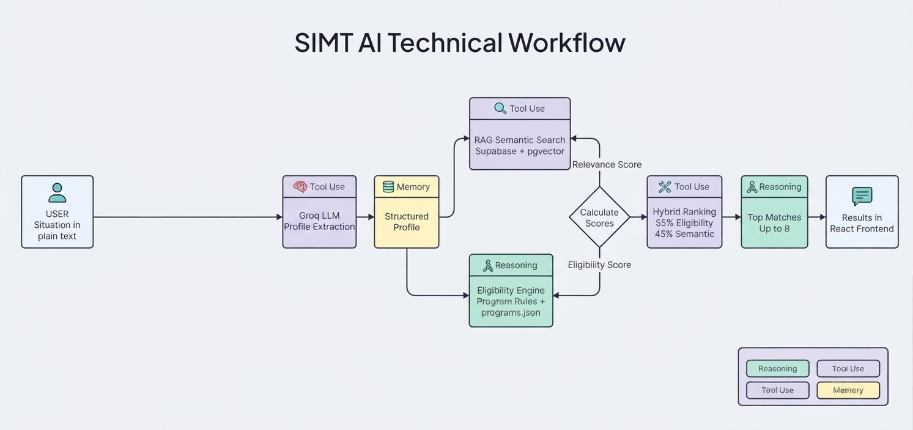

<div align="center">

# SIMT AI

### Intelligent Opportunity Matching for Pakistan

[](https://www.python.org/)
[](https://fastapi.tiangolo.com/)
[](https://react.dev/)
[](https://supabase.com/)
[](https://www.postgresql.org/)
[](#license)

*The government has programs. Citizens have needs. The missing layer is intelligent matching.*

</div>

---

## Overview

SIMT AI is an intelligent opportunity-matching platform that connects people in Pakistan with scholarships, jobs, training programs, business support, loans, grants, and other opportunities relevant to their circumstances. Instead of searching across scattered platforms and figuring out eligibility program by program, users simply describe their situation in plain language, and SIMT AI understands their needs, builds a structured profile, checks eligibility, and uses semantic AI to surface and rank the opportunities that are the best fit.

<div align="center">



</div>

## How It Works

```
User describes their situation
              │
              ▼
     AI Profile Extraction
              │
              ▼
    Structured User Profile
              │
              ▼
    Deterministic Eligibility
              │
              ▼
      Semantic RAG Search
              │
              ▼
        Hybrid Ranking
              │
              ▼
     Top Opportunity Matches
```

**Example input:**

> "I'm 21, unemployed, from Punjab, and I want to start an online clothing business. I need around 12 lakh rupees."

SIMT AI extracts attributes such as age, location, employment status, business goal, sector, and funding requirement, then matches them against eligible programs.

## Key Features

| Feature | Description |
|---|---|
| Natural-language input | Conversational, no forms to fill |
| AI profile extraction | Structures unstructured user descriptions |
| Deterministic eligibility | Rule-based filtering for accuracy |
| Semantic RAG search | Understands relevance beyond keywords |
| Hybrid ranking | Combines eligibility and relevance scores |
| API access | FastAPI backend with interactive Swagger docs |

## Tech Stack

**Frontend** — React · Vite · Supabase Auth
**Backend** — Python · FastAPI · Pydantic · Groq LLM
**AI / Matching** — LLM-based profile extraction · Sentence Transformers embeddings · PostgreSQL + pgvector · Deterministic eligibility engine
**Deployment** — Vercel (frontend) · Render (backend)

## Project Structure

```
SIMT-AI/
├── README.md
├── docs/
│   ├── ARCHITECTURE.md
│   ├── RAG.md
│   ├── ELIGIBILITY.md
│   ├── AI_PIPELINE.md
│   ├── DEPLOYMENT.md
│   └── API.md
│
├── simt-backend/
│   ├── main.py
│   ├── eligibility.py
│   ├── extract_profile.py
│   ├── rag.py
│   ├── seed_rag.py
│   ├── programs.json
│   └── requirements.txt
│
└── simt-frontend/
    ├── src/
    ├── package.json
    └── ...
```


## Why SIMT AI

Opportunity discovery today is fragmented across government portals, universities, NGOs, banks, and individual program websites. SIMT AI is not another directory — it is the intelligence layer that connects people to the opportunities they already qualify for.

**Understand the person → determine eligibility → understand relevance → rank the opportunities.**

---

<div align="center">

Built for a mid-program hackathon submission.

</div>